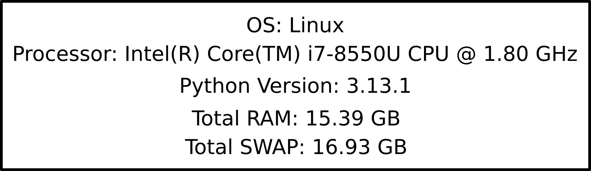
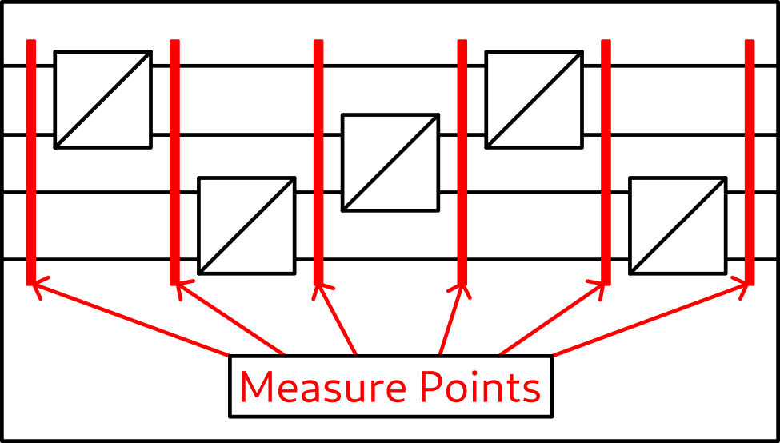
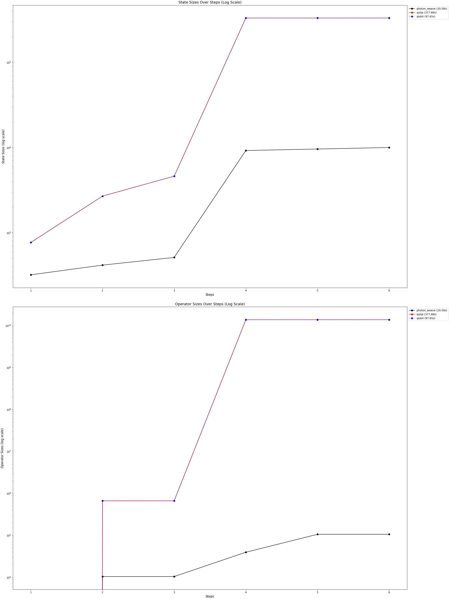

# Benchmarks

All of the benchmarks were carried out on the ThinkPad X1 Carbon 6th Gen:

## Lossy Beam Splitter Circuit
In this Benchmark we test the circuit with five Beam Splitters. This benchmark is an exercise in handling big product spaces, displaying the effect of dimensional adjustment as well as of constructing operators without padding and applying it to the correct subspace. We measure the time of execution as well as the size of the states and operators in the steps.

### Results

### Comments

Photon Weave achieves the lower memory consumptions for the states because of the dimensionality adjusting, which is not a feature of Qiskit or Qutip.
Additionally, in Photon Weave the operators are applied to a subspace directly without padding, which combined with lower dimensionality drastically reduces the operator sizes. These two features, combined with the jit functionality of the jax also translate into drastically lower execution times in this specific benchmark.

## State Management
