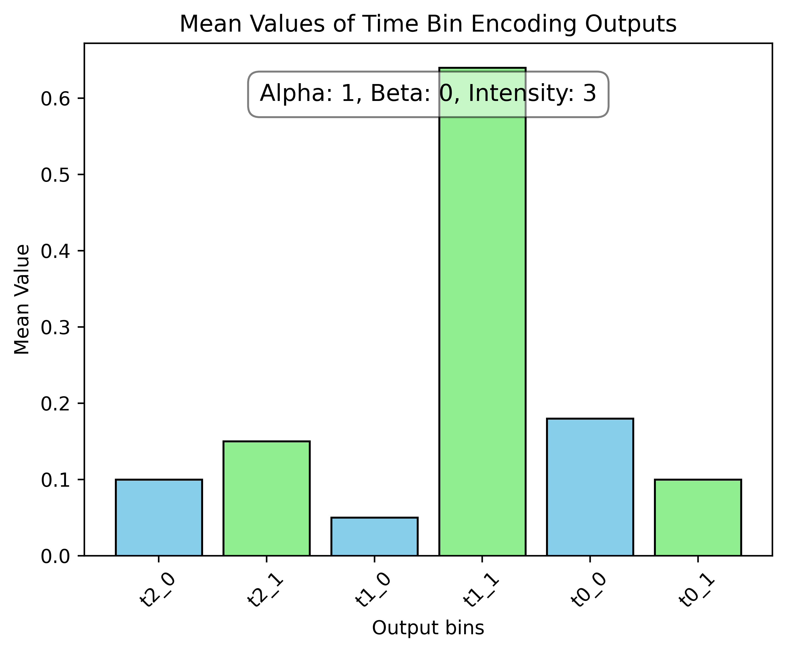

# Photon Weave Usage Examples

## Mach-Zehnder Interferometer
[mach_zehnder_interferometer.py](./mach_zehnder_interferometer.py)

This example demonstrates the simulation of a Mach-Zehnder Interferometer (MZI), a key optical component used in quantum computing and photonics research. The MZI splits an input photon beam into two paths, introduces phase shifts, and then recombines the paths to produce interference patterns.

The diagram below illustrates the simulated output from the Mach-Zehnder Interferometer:

## Time-Bin Encoding
[time_bin_encoding.py](./time_bin_encoding.py)

This example contains a PhotonWeave implementation of Time-Bin Encoding scheme for qubits using tho MZIs. The qubit is encoded into optical pulses that travel through paths of different lengths within the interferometers, creating a time-bin encoding for quantum information. The pulses in each interferometer undergo a beam splitter operation and a phase shift, affecting their final probability distribution.

The simulation models the evolution of the photon states as they pass through the interferometers. The first MZI introduces a controlled superposition of early and late time bins, while the second MZI can be used to recombine the pulses, depending on the phase shifts applied.

